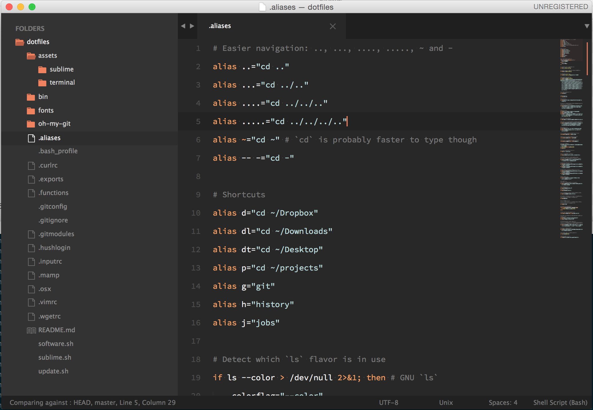

## Installing

1. Install Oh My Zsh:
    `sh -c "$(curl -fsSL https://raw.github.com/robbyrussell/oh-my-zsh/master/tools/install.sh)"`
1. `git clone https://github.com/hansott/dotfiles.git ~/dotfiles --recursive && cd ~/dotfiles && source update.sh`
2. Install Source Code Pro font (`/fonts`)
3. Install the terminal theme:
    * Terminal.app: `assets/terminal/solarized-dark-terminal-app.terminal`
    * iTerm: `assets/terminal/solarized-dark-iterm2.itermcolors`
4. (Optional) Install software:
    `source software.sh`
5. (Optional) Install sublime and configure it:
    `source sublime.sh`

## Updating

`cd ~/dotfiles && git pull origin master && source update.sh`

## Sublime

Run `./sublime.sh` to make your sublime look like this:

## Software

Run `./software.sh` to install the software.

### Command Line Tools
* **wget** to download files from the command line
* imagemagick
* graphicsmagick
* webkit2png
* rename
* zopfli
* **httpie** to test http requests
* ffmpeg
* sshfs
* trash
* node.js
* tree
* ack
* hub
* git
* **speedtest_cli** to test your internet connection
* **ssh-copy-id** to copy your ssh key to a server
* dos2unix

### Mac OS X Apps
* alfred
* dropbox
* google-chrome
* qlcolorcode
* screenflick
* slack
* **appcleaner** to uninstall applications
* firefox
* qlmarkdown
* spotify
* vagrant
* flash
* iterm2
* qlprettypatch
* sublime-text3
* virtualbox
* atom
* flux
* qlstephen
* vlc
* quicklook-json
* skype
* transmission
* carthage
* spectacle
* caffeine
* **asepsis** to remove those annoying .DS_Store files

